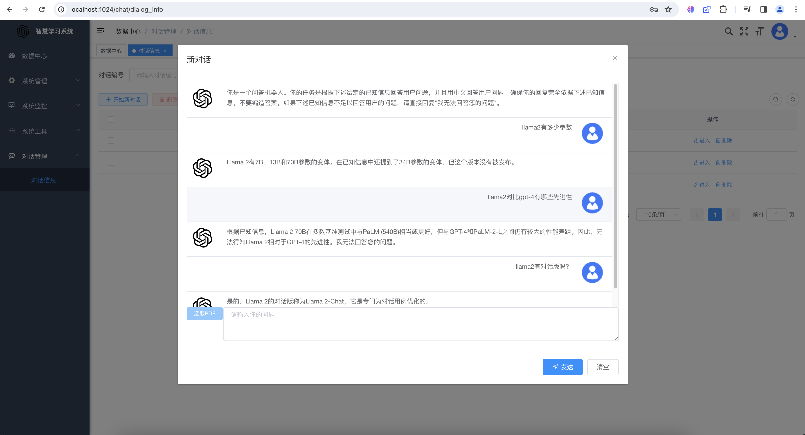
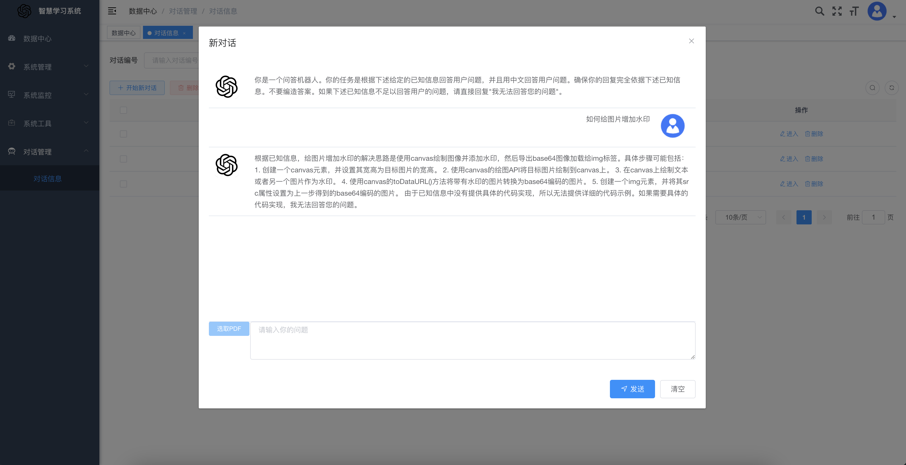
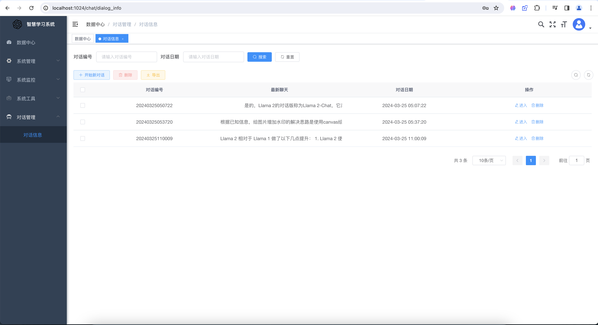

# Chat PDF 知识问答系统

## 基础条件

- LLM API
  - GPT4
  - 生成向量模型
- 向量数据库
  - chroma server
  - chroma client
- pdf解析依赖
- 若依框架

## 准备

- MySQL >> 位于Linux虚拟机

```
docker run --name mysql -p 3306:3306 -d --restart always -e MYSQL_ROOT_PASSWORD=123456 mysql:5.7
```

- redis >> 位于Linux虚拟机

```
docker run --name redis -p 6379:6379 -d --restart always redis
```

- chroma 向量数据库服务端 >> 位于Linux虚拟机

```
docker run --name chroma -p 8000:8000 -d --restart always chromadb/chroma
```

- 若依
- 向量数据库客户端 >> 本地安装

```
pip install chromadb
```

- openai api >> 本地安装

```
pip install openai
```

- pdf解析依赖 >> 本地安装

```
pip install pdfminer.six
```

- Python-dotenv >> 本地安装

```sh
pip install pyhon-dotenv
```

- fastAPI依赖 >> 本地安装，服务器安装

```sh
pip isntall fastapi
pip install "uvicorn[standard]
```

- 准备环境变量

```
OPENAI_API_KEY="sk-******"
OPENAI_BASE_URL="https://******/v1"
CHROMA_HOST="192.168.105.100"
CHROMA_PORT=8000 
```


## 基本思路：

- 第一步，编写RAG脚本
- 第二步，建立库表
- 第三步，生成基础代码
- 第四步，将controller与RAG脚本对接
- 第五步，执行结果返回controller存入MySQL

## 效果






